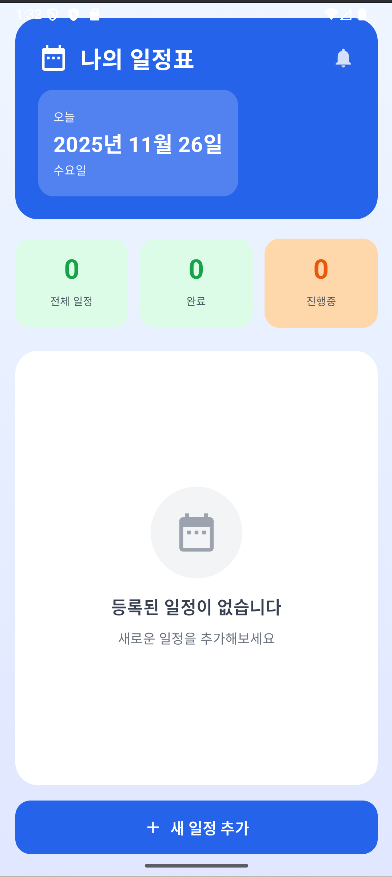

# MOBILE-APP-TEST

<h1>모바일앱 실습 기말고사 프로젝트</h1>

<h3>조원</h3>
<ul>
  <li>박강준</li>
  <li>박현수</li>
</ul>

<h3>캘린더 앱 만들기</h3>

<h4>주요 기능</h4>
<ol>
  <li>일정 추가 기능</li>
  <li>일정 목록 보기</li>
  <li>일정 수정 및 삭제 기능</li>
  <li>일정 완료 표시 기능</li>
  <li>마감일 표시 기능</li>
  <li>마감일까지 남은 날짜 계산</li>
  <li>완료된 일정은 완료 표시 후 하단으로 이동</li>
</ol>

<h2>1일차 작업 기록</h2>

<h3>진행한 작업</h3>
<ul>
  <li>초기화면 디자인 및 구성</li>
</ul>

<b>메인 화면 UI</b>

